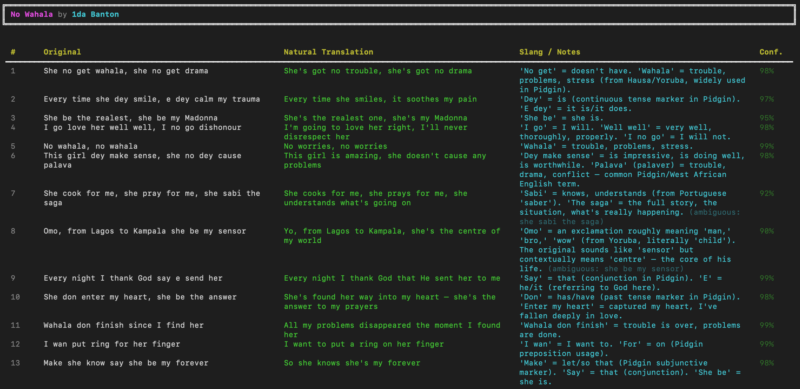

# 🎵 afrobeats-translator

> Every lyric understood. Every word felt.

AI pipeline that translates **Afrobeats & Amapiano** lyrics — Nigerian Pidgin, slang, mixed languages — into plain English with line-by-line cultural context.


---

## Demo

### Wizkid — Essence


### 1da Banton — No Wahala


---

## How It Works

```
lyrics / audio file
  → normalize  (LLM rewrites Pidgin lines into clean intermediate)
  → translate  (literal + natural English, per line)
  → explain    (slang gloss, cultural notes, confidence score)
  → summarize  (theme · tone · language mix · plain-English overview)
  → output     (console · JSON · Markdown)
```

| Stage | What happens |
|---|---|
| **Ingest** | Song title + artist, raw text, or `.mp3` audio file |
| **Transcribe** | OpenAI Whisper (audio path) |
| **Normalize** | LLM cleans Pidgin noise, flags ambiguous phrases |
| **Translate** | Line-by-line literal + natural English |
| **Explain** | Slang glossary + cultural context per line |
| **Summarize** | Theme, tone, language mix, plain-English overview |

---

## Quick Start

```bash
git clone https://github.com/KevinChunye/afrobeats-translator.git
cd afrobeats-translator
python3 -m venv .venv && source .venv/bin/activate
pip install -r requirements.txt
```

Set one API key (Anthropic or OpenAI):
```bash
export ANTHROPIC_API_KEY="sk-ant-..."   # recommended
# or
export OPENAI_API_KEY="sk-..."
```

> **No API key?** The pipeline still runs end-to-end with mock lyrics and stub providers.

```bash
# From mock lyrics DB
python main.py translate-song --song "Essence" --artist "Wizkid"
python main.py translate-song --song "No Wahala" --artist "1da Banton"

# From a text file
python main.py translate-lyrics --input-file data/sample_lyrics.txt

# From audio (requires OPENAI_API_KEY for Whisper)
python main.py translate-audio --audio-file song.mp3

# Save as JSON + Markdown
python main.py translate-song --song "No Wahala" --artist "1da Banton" \
  --output "console,json,markdown" --output-file output/no_wahala.json

# Switch LLM provider
python main.py translate-song --song "Essence" --artist "Wizkid" --llm openai
```

---

## Output Schema

```json
{
  "original_line":       "Baby girl, you sweet like agbalumo",
  "translation_natural": "Baby girl, you're as sweet as agbalumo fruit",
  "slang_explanation":   "Agbalumo = African star apple 🍊 — comparing someone to it signals irresistible sweetness",
  "confidence":          0.98,
  "is_pidgin_heavy":     false
}
```

Plus a song-level summary:
```json
{
  "main_theme":            "Overwhelming romantic attraction, divinely arranged",
  "emotional_tone":        "Romantic, sensual, joyful",
  "recurring_slang":       ["no cap", "agbalumo", "e dey do me", "wey", "dey"],
  "language_mix":          ["English", "Nigerian Pidgin", "Yoruba"]
}
```

---

## Environment Variables

| Variable | Purpose |
|---|---|
| `ANTHROPIC_API_KEY` | Default LLM — Claude |
| `OPENAI_API_KEY` | Alternative LLM + Whisper transcription |
| `DEEPSEEK_API_KEY` | Budget LLM alternative |
| `ELEVENLABS_API_KEY` | Vocal isolation (stub — coming soon) |
| `GENIUS_ACCESS_TOKEN` | Real lyrics via Genius API |

---

## Project Structure

```
src/
  providers/     llm · lyrics · transcription · audio isolation
  services/      ingest · preprocess · transcribe · normalize · translate · explain · format
  utils/         text parsing · file helpers
  pipeline.py    orchestrator
  cli.py         3 Typer commands
tests/           24 tests, all offline (no API keys needed)
```

---

## Roadmap

- [ ] Genius / Musixmatch lyrics API
- [ ] Custom slang glossary (YAML → injected into prompt)
- [ ] Local Whisper (offline transcription)
- [ ] Demucs vocal isolation
- [ ] Web UI + Railway deploy
- [ ] Spotify / YouTube URL support

---

## Contributing

Add a song → edit `_MOCK_LYRICS` in `src/providers/lyrics_provider.py`  
Add a language → update `SYSTEM_PROMPT` in `src/services/normalize.py`
